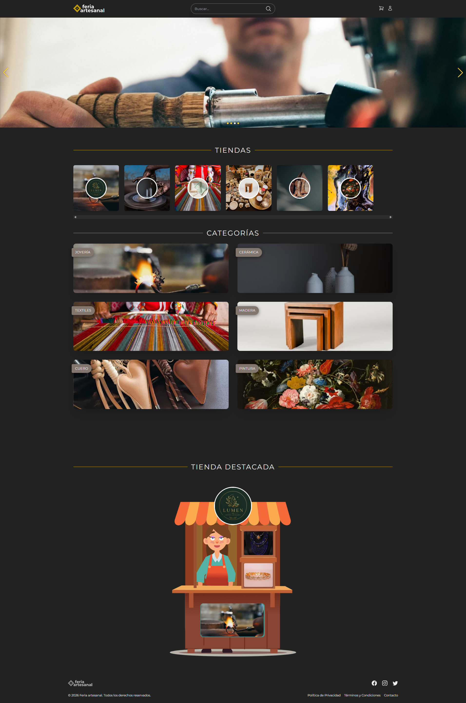

# Feria Artesanal

## Configuración inicial para el Frontend y el Backend

1. **Clonar el repositorio:**
```bash
   git clone https://github.com/sanchezign/Feria-Artesanal
```

### Configuración del Backend

2. Navegar al directorio del backend:
```bash
cd Feria-Artesanal/backend
```

3. Instalar las dependencias:

```bash
npm install
```

4. Configurar las variables de entorno:

Crea un archivo .env dentro de la carpeta /backend y añade las siguientes variables de entorno:

```env
PORT=3000
DATABASE_URL=YOUR_MONGO_DB_URL
JWT_SECRET=YOUR_JWT_SECRET
```

Iniciar la aplicación:

```bash
npm run server
```

### Configuración del Frontend

2. Navegar al directorio del frontend:
```bash
cd ..
cd frontend
```

3. Instalar las dependencias:

```bash
npm install
```

4. Configurar las variables de entorno:

Crea un archivo .env dentro de la carpeta /frontend y añade las siguientes variables de entorno:

```env
VITE_API_BASE_URL=http://localhost:3000/api/
VITE_CLOUDINARY_CLOUD_NAME=YOUR_CLOUD_NAME
VITE_CLOUDINARY_UPLOAD_PRESET=YOUR_UPLOAD_PRESET
```

Iniciar la aplicación:

```bash
npm run dev
```
--- 

### Ejecución conjunta
Para ejecutar el frontend y el backend juntos, asegúrate de que ambos están configurados correctamente y que el servidor del backend está funcionando antes de iniciar el frontend.

#### Contribuciones
Si deseas contribuir a este proyecto, por favor sigue estos pasos:

1. Haz un fork del repositorio.
2. Crea una nueva rama (git checkout -b feature-nueva-funcionalidad).
3. Haz commit de tus cambios (git commit -m 'Añadir nueva funcionalidad').
4. Sube tus cambios (git push origin feature-nueva-funcionalidad).
5. Abre un pull request.

Licencia
Este proyecto está bajo la licencia MIT con atribución.

El sitio -> [Feria Artesanal]( [https://feria-artesanal-git-main-sanchezigns-projects.vercel.app/](https://feria-artesanal-1gumdlxkc-sanchezigns-projects.vercel.app/))

## :::: Vista de HOME ::::




---


