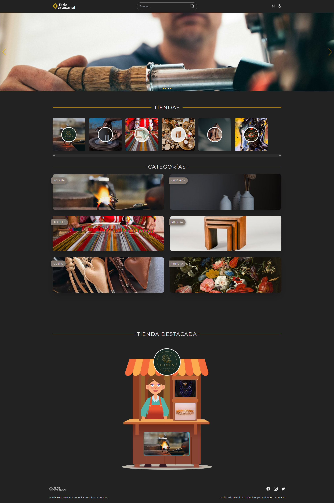

# Feria Artesanal

Marketplace full stack donde los artesanos crean su tienda y publican sus productos, y los usuarios recorren el catálogo por tiendas y categorías.

- **Aplicación en producción:** https://feria-artesanal.vercel.app/
- **Repositorio:** https://github.com/sanchezign/Feria-Artesanal



---

## Usuario de prueba

Cuenta de vendedor con una tienda y productos ya cargados, para probar el flujo completo del artesano:

| Email | Contraseña |
| --- | --- |
| `demo@feriaartesanal.com` | `Demo2026!` |

---

## Funcionalidades

**Para compradores**
- Catálogo de productos con home, carrusel de novedades y tiendas destacadas.
- Navegación por categorías y búsqueda de productos.
- Detalle de producto y página de cada tienda.
- Favoritos y carrito de compras.

**Para artesanos (vendedores)**
- Registro e inicio de sesión.
- Creación de la tienda con nombre, descripción, logo e imagen de portada.
- Publicación de productos con nombre, descripción, precio, stock, categoría, color, material, tamaño e imagen.

**Seguridad**
- Autenticación con JWT (token con validez de 7 días) y contraseñas almacenadas con hash y salt.
- Rutas privadas en el frontend y endpoints protegidos en el backend.
- Roles de usuario (`buyer`, `seller`, `administrator`): solo el dueño de una tienda puede crear, editar o eliminar sus productos.

---

## Tecnologías

| Capa | Tecnologías |
| --- | --- |
| Frontend | React 18, Vite, React Router, React Hook Form, Tailwind CSS, Axios, Swiper |
| Backend | Node.js, Express, Mongoose, JSON Web Token (`jsonwebtoken`, `express-jwt`) |
| Base de datos | MongoDB Atlas |
| Imágenes | Cloudinary |
| Despliegue | Vercel (frontend) y Render (API) |

---

## Estructura del proyecto

```
Feria-Artesanal/
├── backend/
│   ├── controllers/   # Lógica de cada recurso (auth, usuarios, tiendas, productos, órdenes, categorías)
│   ├── models/        # Esquemas de Mongoose
│   ├── routes/        # Definición de endpoints de la API
│   ├── helpers/       # Utilidades y manejo de errores de la base de datos
│   ├── seed*.js       # Scripts para cargar datos iniciales
│   └── index.js       # Punto de entrada del servidor
├── frontend/
│   └── src/
│       ├── api/       # Configuración de Axios (envía el token JWT en cada pedido)
│       ├── components/
│       ├── context/   # Estado global: autenticación, carrito y favoritos
│       ├── hooks/     # Hook de carga de imágenes a Cloudinary
│       ├── pages/
│       └── utils/
└── docs/              # Documentación funcional y capturas
```

---

## Instalación y ejecución local

### Requisitos

- Node.js 18 o superior
- Una base de datos en MongoDB Atlas (o MongoDB local)
- Una cuenta de Cloudinary

### 1. Clonar el repositorio

```bash
git clone https://github.com/sanchezign/Feria-Artesanal
cd Feria-Artesanal
```

### 2. Backend

```bash
cd backend
npm install
```

Crear un archivo `.env` dentro de `backend/`:

```env
PORT=3000
DATABASE_URL=mongodb+srv://<usuario>:<contraseña>@<cluster>.mongodb.net/<base_de_datos>
JWT_SECRET=una_clave_secreta_larga
```

Iniciar el servidor:

```bash
npm run dev     # modo desarrollo, con recarga automática (nodemon)
npm start       # modo producción
```

La API queda disponible en `http://localhost:3000/api`.

Opcional: para cargar datos de ejemplo, ejecutar `node seed-completo.js`.

### 3. Frontend

En otra terminal:

```bash
cd frontend
npm install
```

Crear un archivo `.env` dentro de `frontend/`:

```env
VITE_API_BASE_URL=http://localhost:3000/api
VITE_CLOUDINARY_CLOUD_NAME=tu_cloud_name
VITE_CLOUDINARY_UPLOAD_PRESET=tu_upload_preset
```

Iniciar la aplicación:

```bash
npm run dev
```

El frontend queda disponible en `http://localhost:5173`.

### 4. Configurar Cloudinary

Las imágenes se suben directamente desde el navegador, por lo que se necesita un *upload preset* sin firma:

1. En Cloudinary, ir a **Settings → Upload → Upload presets**.
2. Crear un preset con **Signing mode: Unsigned**.
3. Copiar el nombre del preset en `VITE_CLOUDINARY_UPLOAD_PRESET` y el *cloud name* de la cuenta en `VITE_CLOUDINARY_CLOUD_NAME`.

---

## Despliegue

| Servicio | Plataforma | Variables de entorno |
| --- | --- | --- |
| Frontend | Vercel (raíz del proyecto: `frontend`, framework: Vite) | `VITE_API_BASE_URL` (URL pública de la API, terminada en `/api`), `VITE_CLOUDINARY_CLOUD_NAME`, `VITE_CLOUDINARY_UPLOAD_PRESET` |
| API | Render (raíz: `backend`, comando de inicio: `npm start`) | `DATABASE_URL`, `JWT_SECRET` |

En MongoDB Atlas, habilitar el acceso desde cualquier IP (**Network Access → 0.0.0.0/0**) para que el servidor desplegado pueda conectarse.

---

## API

URL base: `/api`. Los endpoints marcados con 🔒 requieren el encabezado `Authorization: Bearer <token>`.

### Autenticación y usuarios

| Método | Endpoint | Descripción |
| --- | --- | --- |
| POST | `/auth/signin` | Iniciar sesión. Devuelve el token JWT y los datos del usuario. |
| GET | `/auth/signout` | Cerrar sesión. |
| POST | `/users` | Registrar un usuario. |
| GET | `/users/:userId` 🔒 | Ver un perfil. |
| PUT / DELETE | `/users/:userId` 🔒 | Editar o eliminar el propio perfil. |
| PUT | `/users/:userId/favorites` 🔒 | Agregar un producto a favoritos. |
| PUT | `/users/:userId/cart` 🔒 | Actualizar el carrito. |

### Tiendas

| Método | Endpoint | Descripción |
| --- | --- | --- |
| GET | `/shops` | Listar tiendas. |
| GET | `/shops/:shopId` | Ver una tienda. |
| POST | `/shops/by/:userId` 🔒 | Crear una tienda (el usuario pasa a ser vendedor). |
| GET | `/shops/by/:userId` 🔒 | Listar las tiendas del vendedor. |
| PUT / DELETE | `/shops/:shopId` 🔒 | Editar o eliminar la tienda (solo el dueño). |

### Productos

| Método | Endpoint | Descripción |
| --- | --- | --- |
| GET | `/products` | Listar productos. |
| GET | `/products/latest` | Últimos productos publicados. |
| GET | `/products/:productId` | Ver el detalle de un producto. |
| GET | `/products/by/:shopId` | Listar los productos de una tienda. |
| POST | `/products/by/:shopId` 🔒 | Publicar un producto (solo el dueño de la tienda). |
| PUT / DELETE | `/product/:shopId/:productId` 🔒 | Editar o eliminar un producto (solo el dueño de la tienda). |

### Categorías, novedades y órdenes

| Método | Endpoint | Descripción |
| --- | --- | --- |
| GET | `/categories` | Listar categorías. |
| GET | `/news-carousel` | Elementos del carrusel de la home. |
| POST | `/orders/:userId` 🔒 | Crear una orden. |
| GET | `/orders/user/:userId` 🔒 | Órdenes de un comprador. |
| GET | `/orders/shop/:shopId` 🔒 | Órdenes recibidas por una tienda. |

---

## Autor

Desarrollado por **Ignacio Sánchez** · [GitHub](https://github.com/sanchezign)

## Licencia

Este proyecto se distribuye bajo la licencia MIT.
